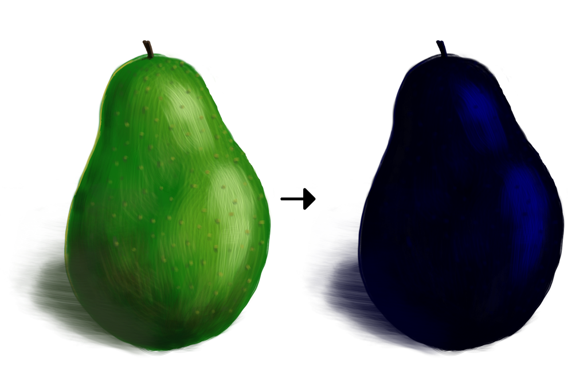
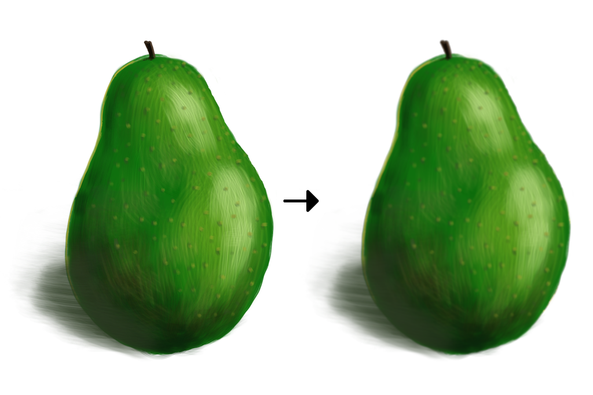
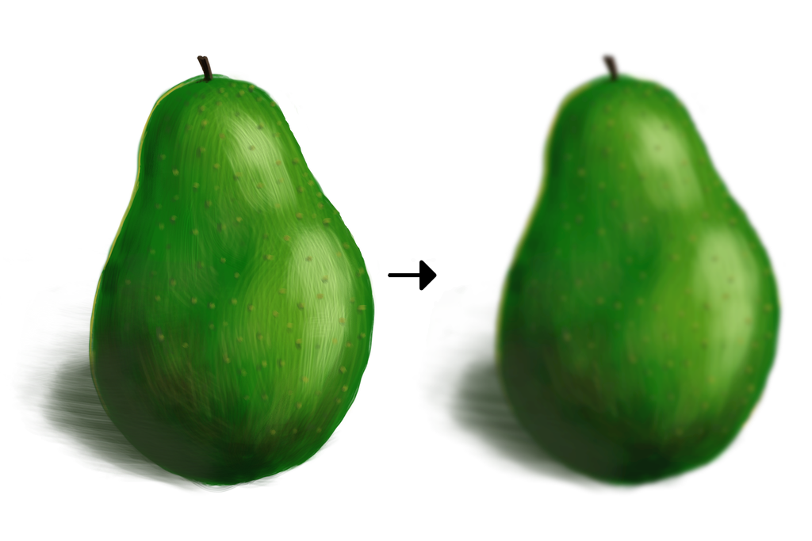
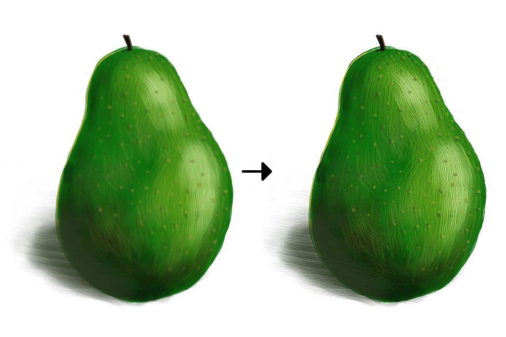
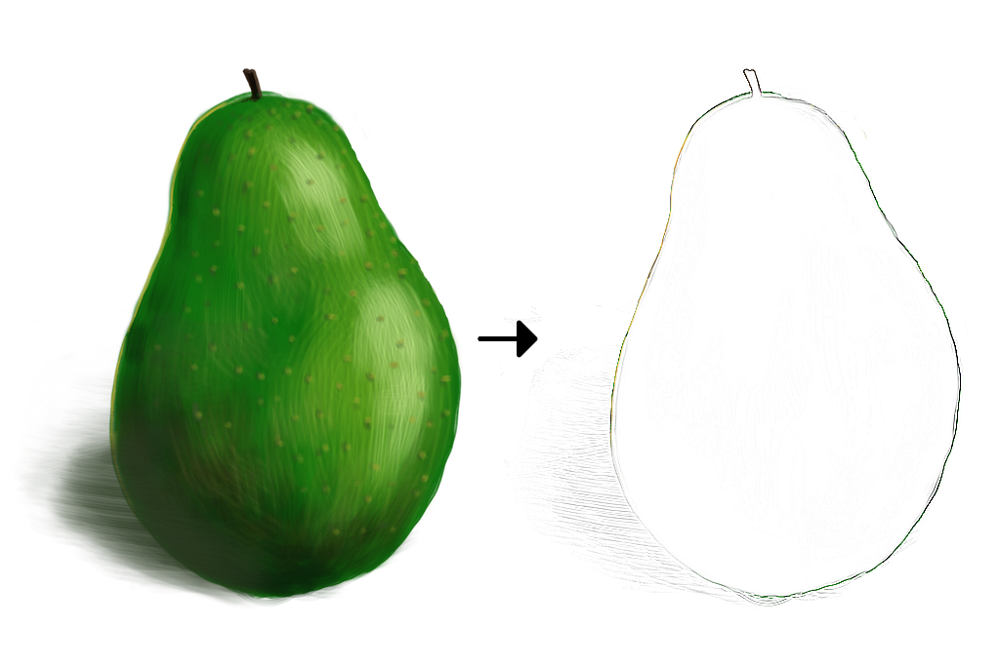

# convolver


[](https://godoc.org/github.com/mandykoh/convolver)
[](https://goreportcard.com/report/github.com/mandykoh/convolver)
[](https://travis-ci.org/mandykoh/convolver)

`convolver` is an image convolution library which extends classical convolution with aggregation operators beyond weighted averaging. This allows for the expression of more image processing operations. The convolution kernels also allow specifying values separately for R, G, B, and alpha channels so that per-channel operations can be supported.

Convolution operations support parallel processing out of the box, allowing the degree of parallelism to be specified for mostly-linear acceleration on multi-core systems.

See the [API documentation](https://godoc.org/github.com/mandykoh/convolver) for more details.

This software is made available under an [MIT license](LICENSE).


## Example usage

Convolution starts with defining a kernel. A kernel has a “radius” which defines the size of a rectangular patch in pixels. For example, for any given pixel, a kernel of radius 2 extends 2 pixels away in all four directions, for a total patch size of 5x5: 

```go
kernel := convolver.KernelWithRadius(2)
```

The above creates an empty 5x5 kernel, where all weights are zero. When applied to an image, each output pixel is the result of some aggregation of the pixels covered by the kernel, centred on the corresponding input pixel. The weights dictate how much each of those pixels contribute to the aggregated result. Weights are specified as integers, and may be specified separately for R, G, B, and alpha channels.


### Channel extraction

Using the weights, we can define a kernel to extract individual colour channels. The following specifies a trivial kernel of radius 0 (meaning it only covers one pixel without consideration of the pixel’s neighbours) where the output is entirely influenced by the blue and alpha channels (weight 1) and where the red and green channels have no influence (weight 0). Because the kernel is 1x1, there is only one set of weights at the x(0),y(0) position.

```go
kernel := convolver.KernelWithRadius(0)
x, y, r, g, b, a := 0, 0, 0, 0, 1, 1
kernel.SetWeightRGBA(x, y, r, g, b, a)
```

Once defined, a kernel can be applied using a given aggregation function (here, averaging, although it doesn’t really matter for a 1x1 kernel):

```go
resultImg := kernel.ApplyAvg(inputImg, parallelism)
```

The `parallelism` parameter allows a kernel to be applied using parallel processing to take advantage of multiple CPU cores. Setting this to 1 means kernel processing is single threaded; setting it to 4 means the processing will be spread across four threads.

The result of extracting only the blue and alpha channels looks like this:




### Gaussian blur

The following specifies a 5x5 kernel that expresses a Gaussian blur by using the `SetWeightsUniform` method, using a single uniform weight for each of the R, G, B, and alpha channels:

```go
weights := []int32{
    1, 4, 6, 4, 1,
    4, 16, 24, 16, 4,
    6, 24, 36, 24, 6,
    4, 16, 24, 16, 4,
    1, 4, 6, 4, 1,
}

kernel := convolver.KernelWithRadius(2)
kernel.SetWeightsUniform(weights)
```

This kernel can be applied to an image with averaging as the aggregation operator like this:

```go
resultImg := kernel.ApplyAvg(inputImg, parallelism)
```

The result looks like this:



Notice that details of the original image have been softened by the blur.

The operations expressed by many kernels can be emphasised in effect by iteratively applying the kernel. For example, we could continue to apply the Gaussian blur kernel another seven times:

```go
for i := 0; i < 7; i++ {
    resultImg = kernel.ApplyAvg(resultImg, parallelism)
}
```

The resulting eight passes would then look like this:




### Sharpening

A simple sharpening kernel can be expressed like this. The weights emphasise contrast between a pixel and its four neighbours:

```go
weights := []int32{
    0, -1, 0,
    -1, 5, -1,
    0, -1, 0,
}

kernel := convolver.KernelWithRadius(1)
kernel.SetWeightsUniform(weights)
```

Applying this kernel (still using averaging) can be done in the same way as before:

```go
resultImg := kernel.ApplyAvg(inputImg, parallelism)
```

And the result looks like this:




### Edge detection

An edge detection kernel might look like this. Note that—unlike sharpening—the weights around the edges sum to zero with the weight in the centre, which means that in areas without a contrasting edge, the output will be zero:

```go
weights := []int32{
    -1, -1, -1,
    -1, 8, -1,
    -1, -1, -1,
}

kernel := convolver.KernelWithRadius(1)
kernel.SetWeightsUniform(weights)
```

When applied:

```go
resultImg := kernel.ApplyAvg(inputImg, parallelism)
```

The result looks like this:




### Dilation

Convolution can also be performed using aggregation functions other than a weighted average.

For example, we can define a simple, uniformly weighted 5x5 “circle” for a kernel:

```go
weights := []int32{
    0, 1, 1, 1, 0,
    1, 1, 1, 1, 1,
    1, 1, 1, 1, 1,
    1, 1, 1, 1, 1,
    0, 1, 1, 1, 0,
}

kernel := convolver.KernelWithRadius(2)
kernel.SetWeightsUniform(weights)
```

However, instead of applying this using the `Avg` operator (which would yield something like a simple blur), we can apply it using a `Max` operator:

```go
resultImg := kernel.ApplyMax(inputImg, parallelism)
```

The `Max` operator aggregates the pixels covered by the kernel and produces the maximum value for each channel. This means that transparent pixels (zero alpha) which are near opaque pixels (full alpha) as dictated by the coverage of the kernel will also become opaque. As always, weights of zero indicate that those pixels have no influence on the result.

The resulting image will be _dilated_ and thickened up, and looks like this:


Of course, this kernel can also be applied in multiple passes. This is the result after applying a second pass (notice the increase in thickness over one pass):


### Erosion

Another aggregation operator is `Min`. Where `Max` finds the maximum values covered by the kernel, `Min` finds the minimum. Using exactly the same kernel as with _Dilation_ above, we can apply a `Min` aggregation instead:

```go
resultImg := kernel.ApplyMin(inputImg, parallelism)
```

This produces an _eroded_ effect, where the features of the original image are thinned down, and looks like this:


And again, additional applications of the kernel will emphasise the effect. This is the result after applying a second pass:


### Closing

More sophisticated operations can be produced by combining convolutions. For example, by performing a _dilation_, and following up with an _erosion_, we can produce a _closing_ effect:

```go
resultImg := kernel.ApplyMax(inputImg, parallelism)
resultImg = kernel.ApplyMin(resultImg, parallelism)
```

This has the effect of smoothing over sharp points, rounding off corners, and closing holes, and is useful for producing smooth “islands” in an image.

We can also iterate this operation to strengthen the effect, performing the dilation twice and then the erosion twice:

```go
resultImg := kernel.ApplyMax(inputImg, parallelism)
resultImg = kernel.ApplyMax(resultImg, parallelism)
resultImg = kernel.ApplyMin(resultImg, parallelism)
resultImg = kernel.ApplyMin(resultImg, parallelism)
```

This produces the following result:


Note the rounding of the sharp corners in the letters C, N, and V.
